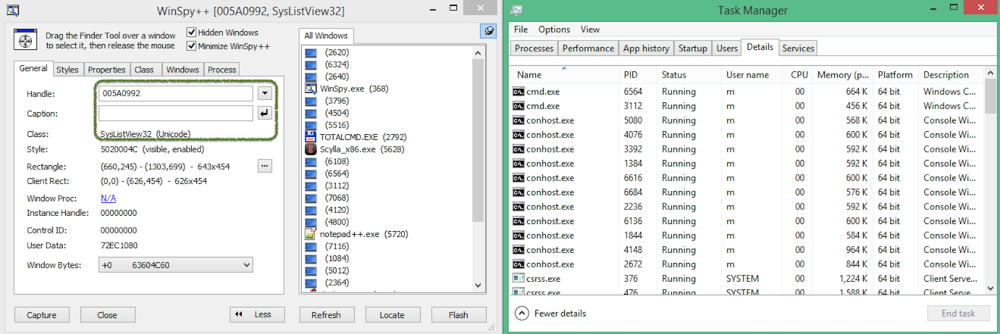
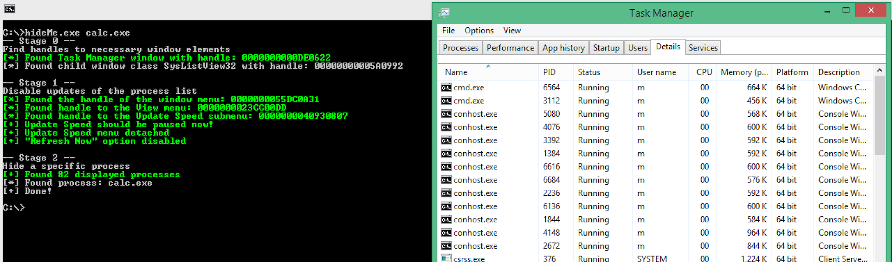

# hide-and-seek

PoC for hiding processes from Windows Task Manager by manipulating the graphic interface

# WORK IN PROGRESS

### Description

Window messages can be used to communicate user actions to other processes. This proof of concept manipulates windows elements from the Windows Task Manager process to hide another process. 

*The same technique can be used to hide Windows services, registry keys from Regedit or other elements* 

> User Interface Privilege Isolation (UIPI) is a technology introduced in Windows Vista and Windows Server 2008 to combat [shatter attack exploits](https://en.wikipedia.org/wiki/Shatter_attack). UIPI's Mandatory Integrity Control prevents processes with a lower integrity level from sending messages to higher integrity level processes (except for a very specific set of UI messages).
 
 Use WinSpy++ or Au3Info to view windows elements and handles
 
 
 WinSpy++ shows elements hierarchy!
 

 Tested on 

UIPI -> admin rights

read other processese memory

### Usage

 *  - Start Windows Task Manager -> Details tab.
 *  - Launch calc.exe
 *  - Launch hideProc.exe
 * 

admin 

disables refresh
updates speed paused

### Compile
compiled with ...
 Microsoft Visual Studio Community 2019
Version 16.5.3

MS Widows 8.1 enterprise Version 6.3.9600
64-bits

### References
 
 * [User Interface Privilege Isolation](https://en.wikipedia.org/wiki/User_Interface_Privilege_Isolation)
 * [Stealing a program's memory](http://www.codeproject.com/Articles/5570/Stealing-Program-s-Memory)
